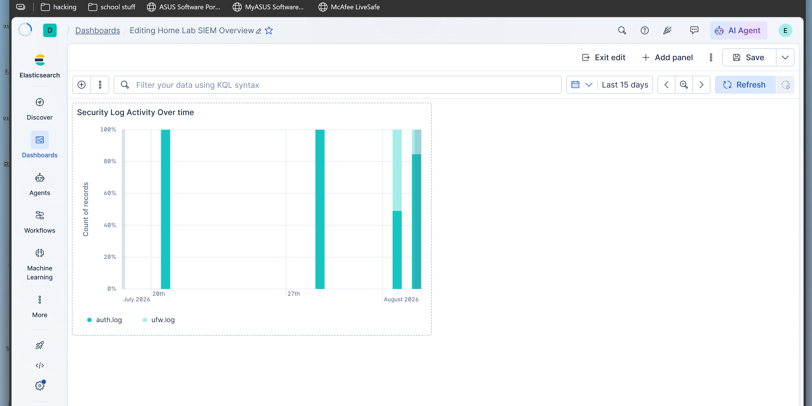

# Home Lab SIEM

I built this to get hands-on with the detection side of security engineering — not just reading about SIEMs but actually standing one up, generating real attack traffic, and writing detection rules that catch it.

The setup: two VMs on an isolated network (an Ubuntu Server victim and a Kali Linux attacker), an Elastic Stack SIEM pulling in host logs, and four detection rules, each one mapped to a MITRE ATT&CK technique and tested against an attack I actually ran myself.

## Architecture

```
┌─────────────────────┐         ┌──────────────────────┐
│   Kali Linux         │         │   Ubuntu Server        │
│   (Attacker)          │ ──────▶ │   (Victim)              │
│   192.168.56.106      │  attacks │   192.168.56.104        │
└─────────────────────┘  over    │                          │
                          host-only│   - OpenSSH server      │
                          network  │   - ufw firewall        │
                                   │   - Elastic Agent        │
                                   │     (standalone)         │
                                   └───────────┬──────────────┘
                                               │ ships logs
                                               │ (auth.log, ufw.log)
                                               ▼
                                   ┌──────────────────────────┐
                                   │   Host Machine             │
                                   │   Elastic Stack (Docker)    │
                                   │   - Elasticsearch            │
                                   │   - Kibana                    │
                                   │   - 4 detection rules          │
                                   └──────────────────────────────┘
```

Both VMs sit on a VirtualBox host-only network (`192.168.56.0/24`). That network also routes to the host machine itself, which is how the Elastic Agent on the Ubuntu VM reaches Elasticsearch running in Docker on my host.

## The attack chain

Instead of running a couple of disconnected demos, I wanted the lab to tell one story — an attacker working through an actual intrusion, stage by stage:

1. **Recon** — port scan the victim to find what's open (MITRE T1046)
2. **Initial access** — brute-force SSH on the port I found (MITRE T1110)
3. **Privilege escalation** — abuse a misconfigured sudo account (MITRE T1548.003)
4. **Persistence** — plant an SSH key so I can get back in without a password (MITRE T1098.004)

Each stage has its own detection rule written in ES|QL, running on a schedule against live log data — not a one-off search I ran manually.

## Detection rules

| # | Detection | MITRE Technique | Data Source | Writeup |
|---|-----------|-----------------|--------------|---------|
| 1 | SSH Brute Force | [T1110 - Brute Force](https://attack.mitre.org/techniques/T1110/) | `auth.log` | [detections/01-ssh-brute-force.md](detections/01-ssh-brute-force.md) |
| 2 | Port Scan | [T1046 - Network Service Discovery](https://attack.mitre.org/techniques/T1046/) | `ufw.log` | [detections/02-port-scan.md](detections/02-port-scan.md) |
| 3 | Privilege Escalation | [T1548.003 - Sudo and Sudo Caching](https://attack.mitre.org/techniques/T1548/003/) | `auth.log` | [detections/03-privilege-escalation.md](detections/03-privilege-escalation.md) |
| 4 | SSH Key Persistence | [T1098.004 - SSH Authorized Keys](https://attack.mitre.org/techniques/T1098/004/) | `auth.log` | [detections/04-persistence-ssh-key.md](detections/04-persistence-ssh-key.md) |

## Dashboard

A Kibana dashboard I built to track log activity across both data sources over time:



## Stack

- **Elasticsearch + Kibana** — via [Elastic's `start-local` script](https://github.com/elastic/start-local), running in Docker
- **Elastic Agent** — standalone mode (no Fleet Server), configured directly through `elastic-agent.yml`
- **VirtualBox** — Ubuntu Server 26.04 LTS (victim) + Kali Linux (attacker), host-only networking
- **ufw** — Ubuntu's firewall, with logging turned on to catch blocked connection attempts
- **Detection rules** — Kibana's Elasticsearch Query Rule type, using ES|QL for parsing (`GROK`) and aggregation (`STATS`)

## Design decisions (and things I'd change for production)

**Standalone Elastic Agent instead of Fleet-managed.** I configured the agent directly through YAML instead of standing up a separate Fleet Server, mostly to keep the lab from ballooning in scope. At real scale, Fleet-managed agents would make a lot more sense for centralized policy management.

**ES|QL instead of Kibana's built-in threshold rules.** The raw logs (`auth.log`, `ufw.log`) aren't structured — I needed `GROK` to pull fields like source IP out of plain text lines before I could aggregate on them, so a full ES|QL query was the right tool rather than a simple threshold rule.

**Rate-limited firewall logging.** I learned this one the hard way — `ufw` doesn't log every blocked packet by default, just a rate-limited sample. My first port scan threshold assumed full logging and never fired. I tuned it down once I checked how many entries were actually landing in the logs.

**5-minute detection windows.** I started with a 1-minute window to match the attack pattern (5+ failed logins in 60 seconds), but that was too tight once I accounted for the lag between running an attack and switching over to check Kibana. Widened it to 5 minutes for reliable testing — a production deployment watching continuous traffic could safely go tighter.
